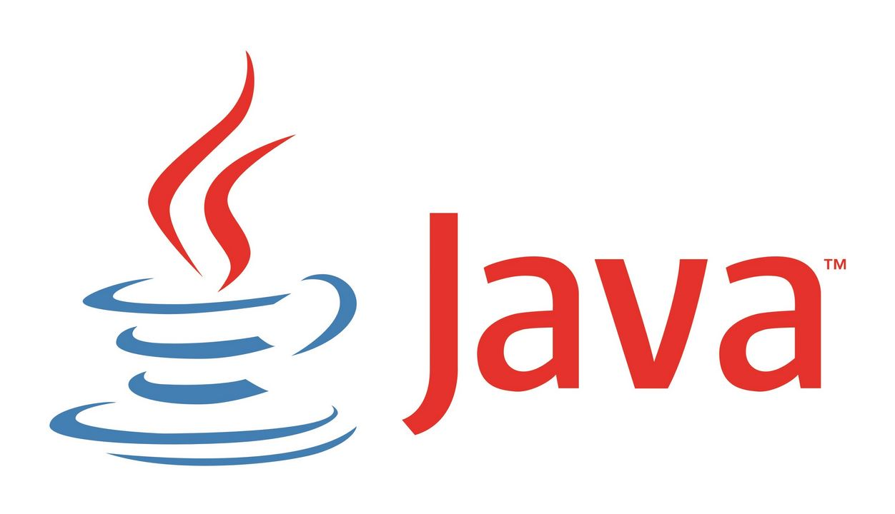

Café en argot américain est la boisson favorite de nombreux programmeurs.
# Java
### Kesako ? 
- Langage de programation orienté objet créée en 1995 et gérer par [Oracle](https://www.oracle.com/fr/index.html)
### Utilité ? 
- Créer des logiciels, des applications web ou encore des applets (programmes java incorporés à une page web). Compatible sur toutes les plateformes Unix,Windows...
- Des Jeux, etc...
### Pourquoi l'utiliser ?
- Car il est sécuriser, rapide et puissant.
- Open-Source and free !
- Fonctionne sur differente platforms Windows,Mac...

# Installation

## Quelle version ?
Télécharger et installer le JDK (Java Development Kit)  
Pourquoi le **JDK** et pas le **JRE**, car le JRE ne contient que les outils qui permette d'exécuter du java, et le JDK de développer en Java (en plus le JDK contient le JRE ce qui semble logique).

[Windows & Mac](https://www.oracle.com/technetwork/java/javase/downloads/jdk12-downloads-5295953.html)  
[Ubuntu](https://www.java.com/fr/download/help/linux_x64_install.xml#install)

## Apres l'installation
Vous pouvez soit utilisez le terminal de commande pour compiler et lire vos fichier .java soit passer directement par votre [IDE](https://fr.wikipedia.org/wiki/Environnement_de_d%C3%A9veloppement).
### Terminal de commande (PowerShell..)
```
cd mon/emplacement/fav
touch test.java
code . // ouvre tout le contenue de votre dossier dans vote IDE, insérer votre code Java
javac // compile votre fichier java
java // lis votre fichier java compiler  
```
### IDE Visual Studio Code
Vous pouvez utilisez cette extension qui permette l'auto-completion, la compilation, la lecture de vos fichier .java 
> Très pratique !  
[Extension Java pour VS-Code](https://marketplace.visualstudio.com/items?itemName=vscjava.vscode-java-pack)

*Attention d'avoir installer correctement votre [JDK](https://www.oracle.com/technetwork/java/javase/downloads/index.html)

## Sources
[w3s Java](https://www.w3schools.com/java/default.asp)  
[Oracle Java](https://www.oracle.com/technetwork/java/javase/downloads/index.html)